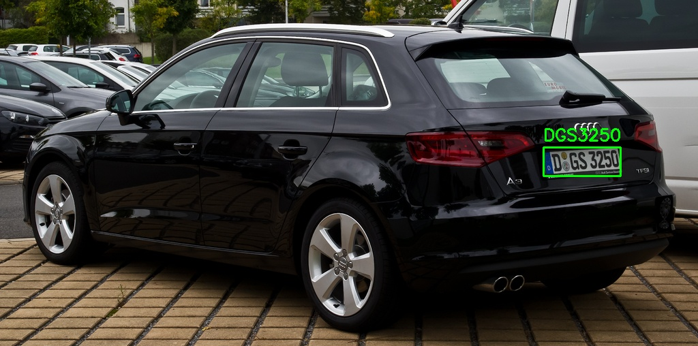
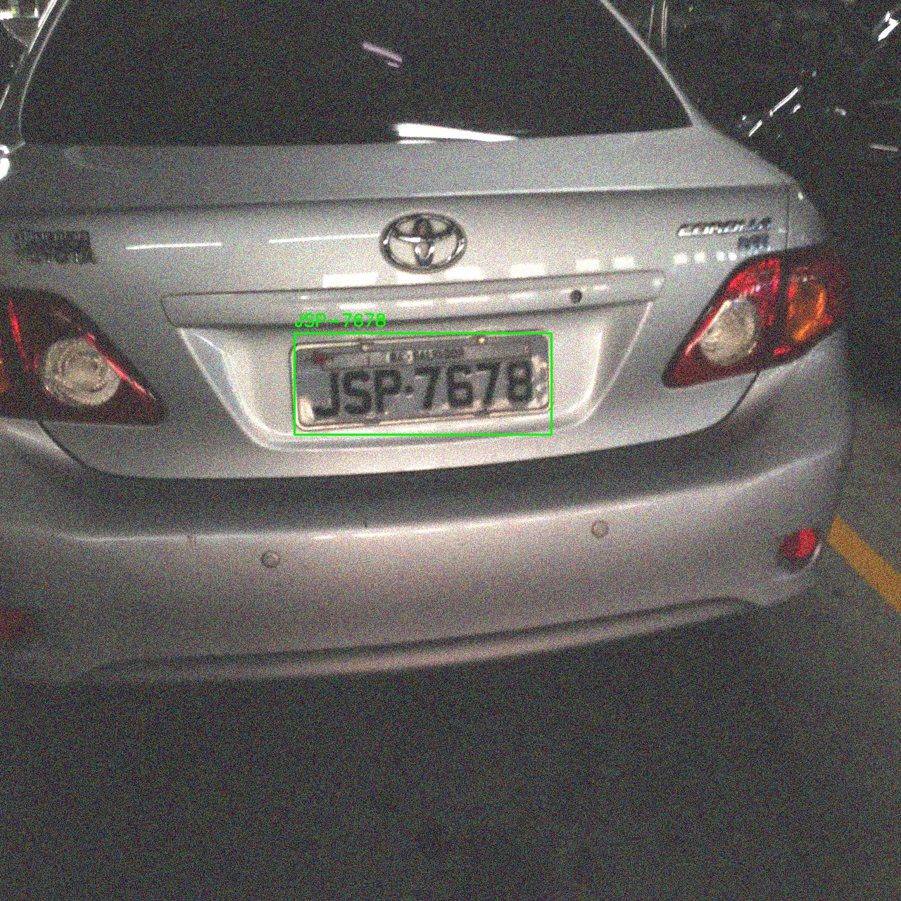
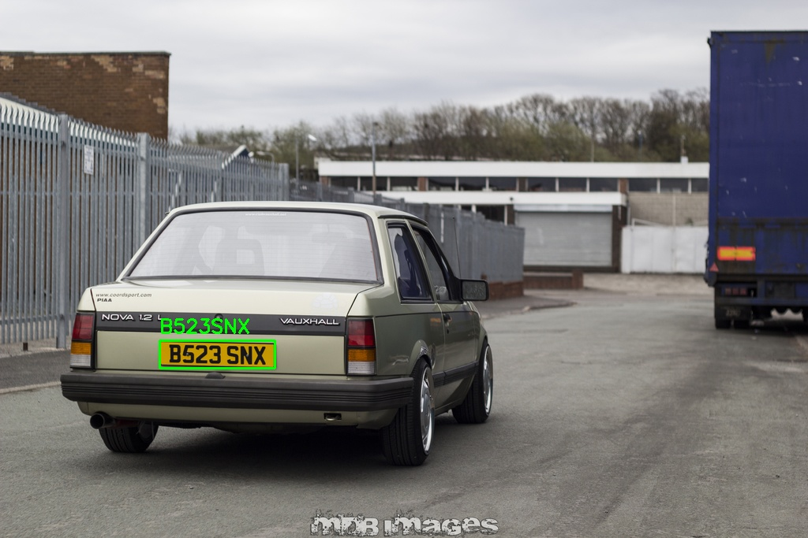
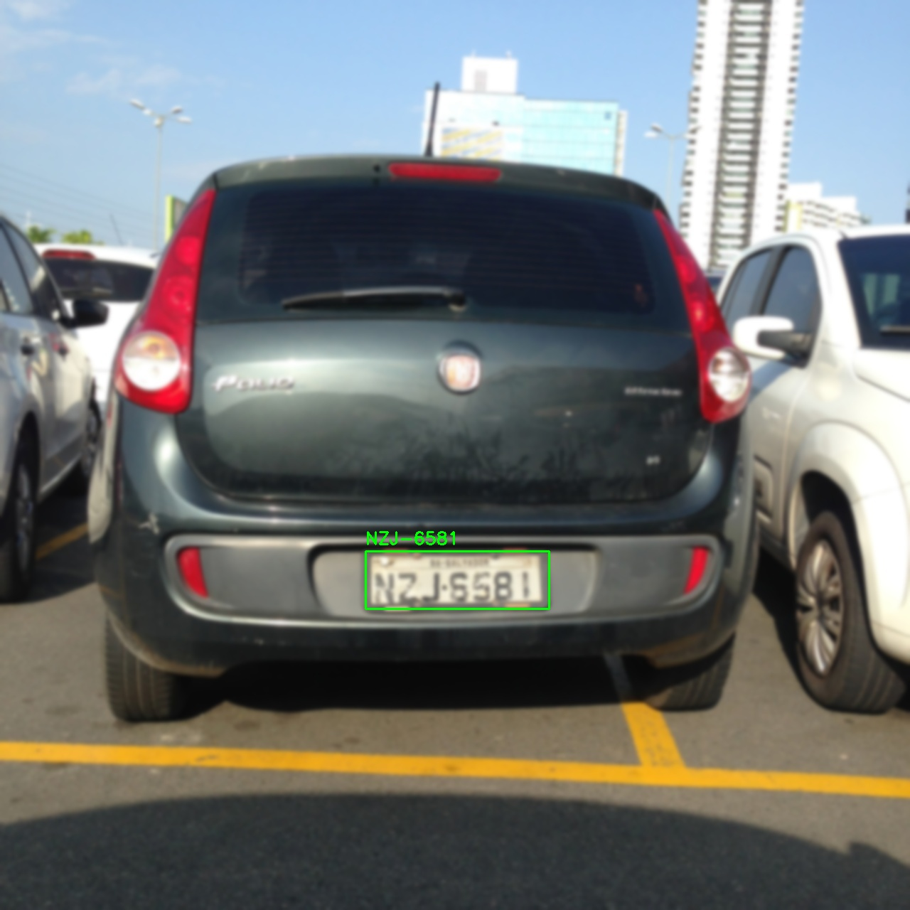

# License Plate Detection and Recognition for Automatic Parking Space
This project implements a system for detecting and recognizing license plates in automatic parking spaces. The solution is built using YOLO-based object detection models for license plate localization and PaddleOCR for text recognition.


Here are some sample results:
<div align="center" style="display: flex; gap: 20px;">
  
  
</div>

<p align="center">
  
  
</p>

<p align="center">
  
  
</p>


# Project Overview
The project aims to create a robust and efficient license plate detection and recognition system. The pipeline involves:
1. Detecting license plates in images using YOLO models.
2. Extracting text from detected plates using Optical Character Recognition (OCR) with PaddleOCR.

# Dataset
The dataset consists of:
Original Images: 652 images collected from diverse sources.
Augmented Data: 20% of images were augmented with rain, fog, and shadow conditions.

Splits:
Training: 70%
Validation: 20%
Testing: 10%

# Models Used
YOLOv8n (Nano): Achieved the best performance in detection tasks.

YOLOv8s (Small): A lightweight model used for comparison.

YOLOv9c: Tested for performance benchmarking.

| Model     | Precision (P) | Recall (R) | mAP@50 | mAP@50-95 | Preprocessing Time (ms) | Inference Time (ms) |
|-----------|---------------|------------|--------|-----------|-------------------------|----------------------|
| YOLOv9c   | 0.929         | 0.945      | 0.950  | 0.736     | 0.1                     | 6.1                  |
| YOLOv8s   | 0.946         | 0.950      | 0.951  | 0.752     | 0.1                     | 1.7                  |
| YOLOv8n   | 0.949         | 0.940      | 0.949  | 0.742     | 0.1                     | 1.3                  |


Best Detection Model: YOLOv8n was selected based on evaluation metrics.

Text Recognition: PaddleOCR was integrated for extracting the text from detected license plates.

# Installation and Setup
Clone the repository:
```
git clone https://github.com/AsmanyAkter/Licence-plate-detection-and-recognition-for-automatic-parking-space.git
cd Licence-plate-detection-and-recognition-for-automatic-parking-space
```
Create and activate a virtual environment (optional but recommended)
```
python3 -m venv env
source env/bin/activate  # For Linux/MacOS
```
Install the required dependencies:
```
pip install -r requirements.txt
```
Run the detection pipeline :  Change the weight path
```
licence_plate_inference_code.ipynb
```

Perform OCR on detected plates:
```
complete_pipeline.ipynb
```
